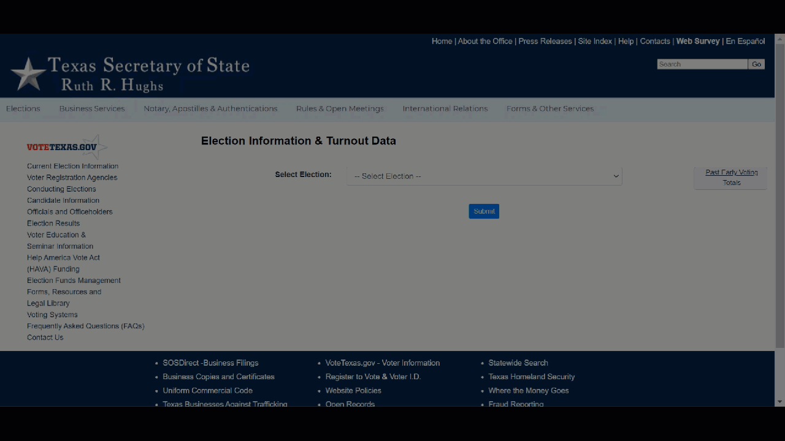

## Context, Please

On even numbered years, I spend a lot of my free time volunteering with downballot voter turnout initiatives. Over the years, I've worked across 10+ states -- each with their unique datasets and data debacles. While there are some standard vendors and APIs, much of the final voter turnout data is highly bespoke. Every state -- even *county* -- in the country can come up with it's own publishing format (federalism, eh?) leading to unique data collection challenges. 

Trying to scrape and wrangle this data has proven a fun survey on the wide breadth of automated data collection tools. Even moreso, it's cause to reflect on how different data formats cater to the needs of different audiences and how design choices as data publishers can be more or less constructive to different audiences. 

I also failed to give a good answer when asked on the pod how to help turnout voters because -- hey, I'm just the data person. But realistically the most important thing you can do is **tell people in your life to vote, ask them their plan, offer them a ride**. What the data *does* often imply is that you should never underestimate how many non-voters (although behavior is admittedly highly correlated) you probably know. Help them know their voice matters. 

## Behind the Scenes

The data can come from any number of state and county websites. Packages vary based on the setup, including:

- direct file download with `requests`
- basic static web scraping with `BeautifulSoup`
- dynamic web scraping with `Playwright`
- headless browser automation with `Playwright`
- screenshotting and image parsing with `tesseract` 

Examples of different pipelines and patterns can be found in:

- [Goin' to Carolina on my Drive](https://www.emilyriederer.com/post/duckdb-carolina/index.html) -- blog from 2022. Could be much further optimized now with advanced in polars and duckdb. CSV sniffing, for one, has improved a *lot* 
- [A Tale of Six States](https://www.emilyriederer.com/post/states-scraping-automation/index.html) -- blog from 2021. Some states have changes formats since so are outdated
- [GitHub Repo](https://github.com/emilyriederer/data-scraping-states) -- update of the 6 states from 2024. Less out of date? 

I've been tracking my more recent travails updating pre-existing data pipelines on [Bluesky](https://bsky.app/profile/emilyriederer.bsky.social/post/3munrhupr2c2i).

## Analysis

I think a lot of people know about basic web scraping already, so here, I will demonstrate my favorite and lesser used pattern: headless browser automation. While it has a crazy name, the simple idea is to ask your computer to do very human steps of navigating a browser: looking, finding, clicking, selecting, waiting, refreshing, etc. This is easily down with the python package `Playwright`. 

To navigate and download files from the [Texas Secretary of State], I wanted to follow the steps illustrated below:



This is accomplished by this relatively minial [script](https://github.com/emilyriederer/data-scraping-states/blob/main/04-browserauto-tx.py). The real trick is using your browser's developer tools to identify what fields you want to target. 

```{python}
#| eval: false

from playwright.sync_api import sync_playwright
import datetime

def retrieve_date(date, page):

  # navigate to date-specific page 
  target_date = datetime.datetime.strptime(date, '%Y%m%d')
  target_date_str = target_date.strftime('%Y-%m-%d 00:00:00.0')
  target_file = 'tx-' + target_date.strftime('%Y%m%d') + '.csv'
  
  # pick election
  page.goto('https://earlyvoting.texas-election.com/Elections/getElectionDetails.do')
  page.select_option('#idElection', label = "2020 NOVEMBER 3RD GENERAL ELECTION")
  page.click('#electionsInfoForm button')
  page.wait_for_selector('#selectedDate')
  
  # pick day
  page.select_option('#selectedDate', value = target_date_str)
  page.click('#electionsInfoForm button:nth-child(2)')
  page.wait_for_selector('"Generate Statewide Report"')

  # download report  
  with page.expect_download() as download_info:
    page.click('"Generate Statewide Report"')
  download = download_info.value
  download.save_as(f'data/{target_file}')

with sync_playwright() as p:

  browser = p.firefox.launch()
  # want to see it in action? Switch to firefox.launch(headless=False, slow_mo=50)
  context = browser.new_context(accept_downloads = True)
  page = context.new_page()
  
  dates = ['20201020','20201021','20201022']
  for d in dates:
    retrieve_date(d, page)

  # cleanup
  page.close()
  context.close()
  browser.close()
```

I personally am much more interested in collecting this data for mercenary operational purposes than for analysis, so I don't have pretty plots and charts to share. However, I will mention that the NC election data is a special type of **amazing** with rich history and metadata as required by state law. It's become one of my favorite datasets to do a quick test of different modeling ideas (my personal `penguins`). If anyone wants it to play with or use for a class, please feel free to reach out and I would be happy to share. 